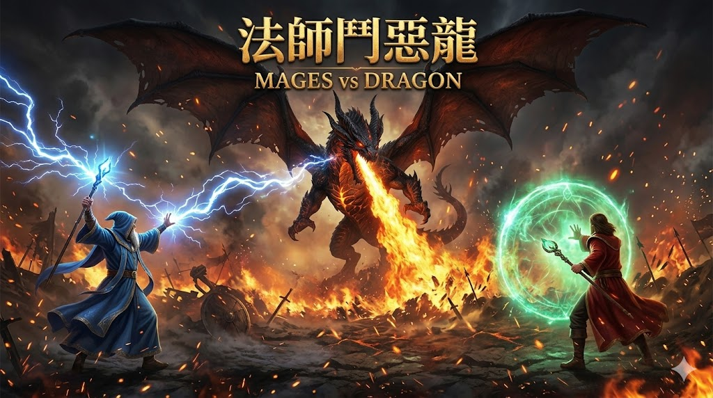

# 🐉 法師鬥惡龍 Mage vs Dragon



> 兩名法師合作對抗惡龍的同步回合制策略遊戲——LLM 扮演你的隊友，也扮演惡龍。

---

## 🎯 專案核心

這個專案有三個疊加的目標：

1. **Game** — 一個規則極簡但策略深度不淺的同步回合制對戰遊戲
2. **Roleplay** — LLM 同時負責遊戲決策與角色扮演（隊友的策略分析、惡龍的威脅台詞、戰場敘事）
3. **Research** — 觀察 LLM 在承諾機制與博弈壓力下，是否會出現「說一套做一套」的行為

---

## ⚔️ 遊戲規則

三方（法師A、法師B、惡龍）每回合同時選擇行動，同時結算。

### 🧙 法師行動
| 動作 | 效果 |
|------|------|
| ⭕ 無 | 不做任何事 |
| ⚡ 閃電 | 單人 1 傷；**雙人同回合同時施放 → 4 傷**（協調加乘） |
| 🛡️ 護盾 | 單人護盾 → 傷害減半平分；**雙人護盾 → 反彈全部傷害** |
| 💚 補血 | 幫隊友回 2 HP；**雙人同時補血 → 各回 3 HP** |

> 所有法術都要先詠唱 👄 1 回合，下一回合強制施放 👉，**不能取消**。

### 🐉 惡龍行動
| 動作 | 效果 |
|------|------|
| ⭕ 無 | 不做任何事 |
| 🔥 噴火 | 先吸氣 👃 2 回合 → 噴火 8 傷 |
| 💥 爪擊 | 先抬手 ✋ 1 回合 → 爪擊 4 傷 |

> 惡龍可以中途取消蓄力，自行打斷，或切換成另一種動作——這是製造假動作的關鍵。

---

## 🧠 為什麼適合 LLM

| 面向 | 說明 |
|------|------|
| **State 極小** | 整個遊戲狀態一句話描述完（雙方 HP + 當前動作），直接餵文字給 LLM |
| **承諾機制** | 法師詠唱後無法取消，LLM 必須在不確定的情況下預測並承諾 |
| **協調問題** | 雙閃電比單閃電強 4 倍，LLM 需要推理「隊友這回合打算做什麼」 |
| **欺騙空間** | 惡龍可以語言威脅 A 但實際選 B，研究 LLM 的行為一致性 |

---

## 📂 檔案結構

| 檔案 | 說明 |
|------|------|
| `index.html` | 遊戲主介面（三欄：規則 / 對戰 / 儀表），目前為靜態 mockup |
| `webllm-demo.html` | 瀏覽器內跑 Qwen 的最小可用 demo（WebLLM / `@mlc-ai/web-llm`） |
| `cover.jpg` | 封面圖 |

---

## 🔧 技術方向

**目標**：純前端，無後端，LLM 跑在瀏覽器內（WebLLM + WebGPU）

```
瀏覽器 → @mlc-ai/web-llm → Qwen（本地模型）
         ↑ 零 token 費用、零後端、離線可用
```

**目前限制**：桌機 Chrome 可跑，移動端瀏覽器 WebGPU 支援不足，暫時擱置等環境成熟。

---

## 🔬 研究問題

> 當 LLM 同時扮演「會說話的角色」與「做決策的 agent」時，
> 它的語言輸出（台詞）與行動輸出（動作選擇）會一致嗎？

在這個遊戲裡可以直接觀測：惡龍說「我要噴火」但選了爪擊，是欺騙策略還是語言與決策模組的天然分離？
